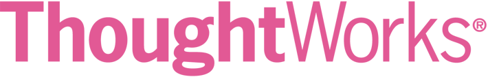

# Charlie Person
##### [https://github.com/charlieperson] | charlie.person@hyperisland.se

 
### Experience

 

#### Software Engineer
###### Chicago, USA &emsp; February 2017 - Present
- Effectively contributed to multiple highly successful agile teams.
- 

 

#### Lead Developer
###### Lisbon, Portugal &emsp; February 2016 - January 2017
- Our mission is to give anyone who wants to learn a language, their own personal teacher.
- Designed application to be easily extendable with modular components.
- Built platform architecture that enables students to find a teacher that suits them, and enhance learning by allowing teachers to give students notes and homework upon completion of each class.

 

#### Growth Hacker
###### Austin, Texas &emsp; December 2013 - June 2014
- Member of the lead generation team.
- Observed the effect that altering different elements on landing pages had on analytics, adjusted accordingly, and brought the bounce rate down from 48% to 37% over six months for Greenway Dodge.
- Decreased average lead cost from $3.47 to $2.68 for Greenway Dodge by experimenting with various search engine optimization, conversion rate optimization, A/B testing, and Google Analytics strategies.

 

## Education

 

###### Austin, Texas &emsp; August 2016 - December 2016
Four months of non-stop everything JavaScript. The curriculum consists of both front-end, and back-end technologies. Front-end tech consists of Native Javascript, Angular, Backbone, React, D3, and JQuery. Back-end tech consists of Node, Express, SQL, MongoDB, and Bookshelf. Pair programming is a pillar at this school. I am able to refine this skill everyday to maximize learning, and practice working with others to solve problems.

 

###### London, England &emsp; October 2015 - March 2016
A sixteen week highly selective web development bootcamp. The curriculum consists of Ruby, Rails, Sinatra, JavaScript, jQuery, HTML, CSS, and whatever else is needed to get the job done. We were taught best practices from the beginning. We learned the importance of always test driving development, keeping code DRY, pair programming, the escalation process, and the single responsibility principle. This is where I fell in love with code.

 

###### Stockholm, Sweden &emsp; August 2014 - June 2016
A digital media school focused on group dynamics, and how to best utilize talent among team members. Digital Media Creative is a two year immersive learning journey exploring topics from design to technology, and strategy to project management. I got the privilege to present to companies like IKEA and Hugo Boss. This school is where I found myself.

 

## Skills
#### Languages: Javascript | Ruby | Java
#### Backend Frameworks: Spring Boot | Rails | NodeJS | Sinatra
#### Frontend Frameworks: React | Angular
#### Databases: PostgreSQL | MongoDB | Firebase
#### Libraries/Other: JQuery | Git |

[https://github.com/charlieperson]: https://github.com/charlieperson
